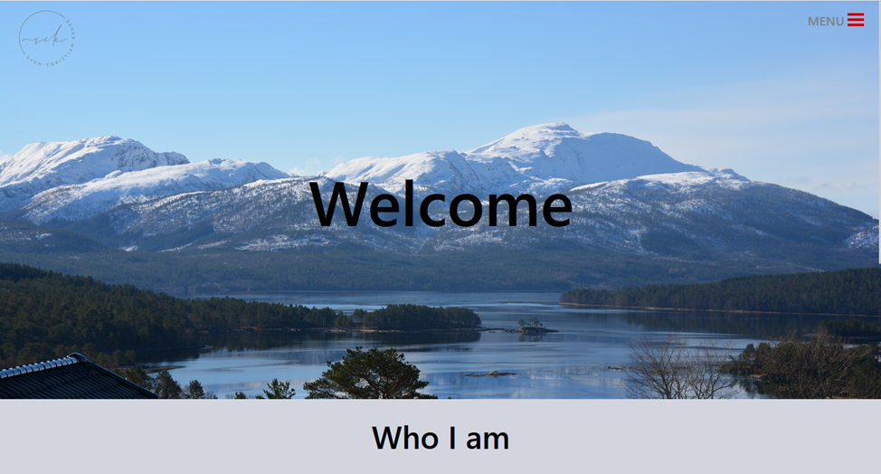
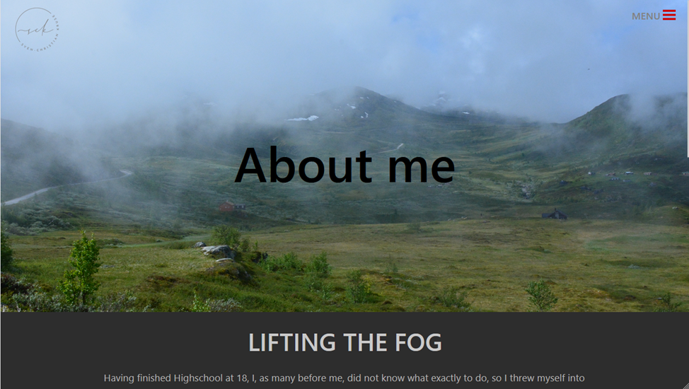
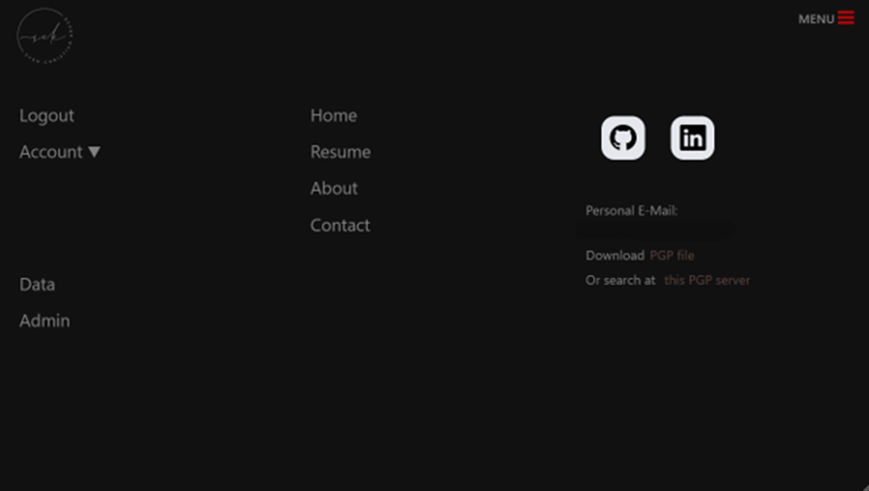
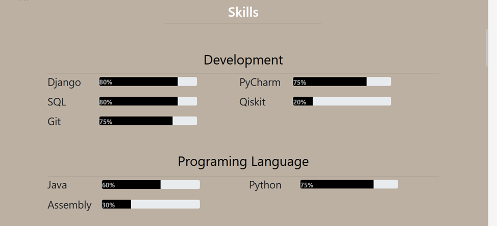
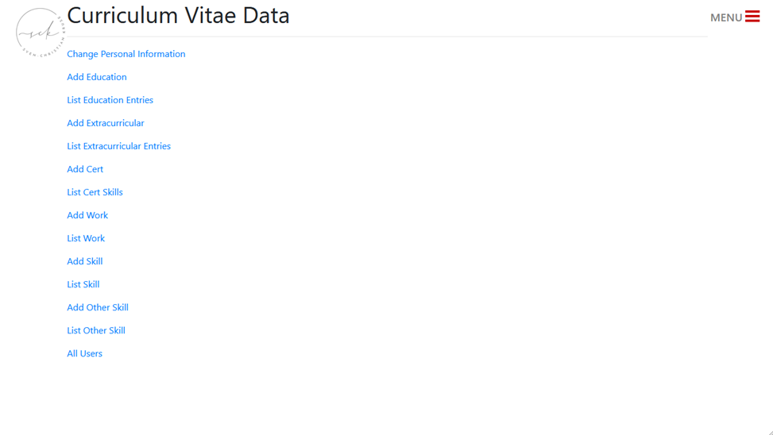
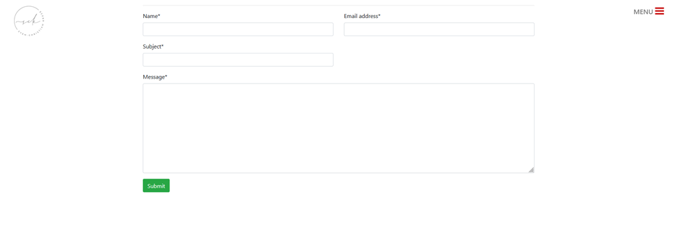

# About this project

This project started out simply to learn django and python but turned into my first personal website.
As the data displayed is stored in a database and can be changed easily it's a useful personal website to display resume etc.

## What this project has to offer

- A personal website where you can showcase your resume and skills nicely
- Contact and About me page
- Login! so only those intended can see it
- Backend to easily change entries in the "resume" and to manage all contents
- The frontend will be populated after entering the data in the "Data" Section 
    - Only admins have access to the "Data" and "Admin" Sections
- Not logged in users can only see the "Home" Section

## Be aware!:
- I have abandoned this website, but did use it for a while in production!
- As this was my first major project in general and with django/python the structure and code might be somewhat messy (I will try to clean up)
- Check the documentation folder for information about the structure, setup, deployment etc.
- There might be bugs! Feel free to contribute with fixes or create issues!

## How it looks (just a small glimpse! There is much more):
### Homepage

## About

## Navbar

## Resume

## Data that the frontend is filled with

## Contact

## Footer

